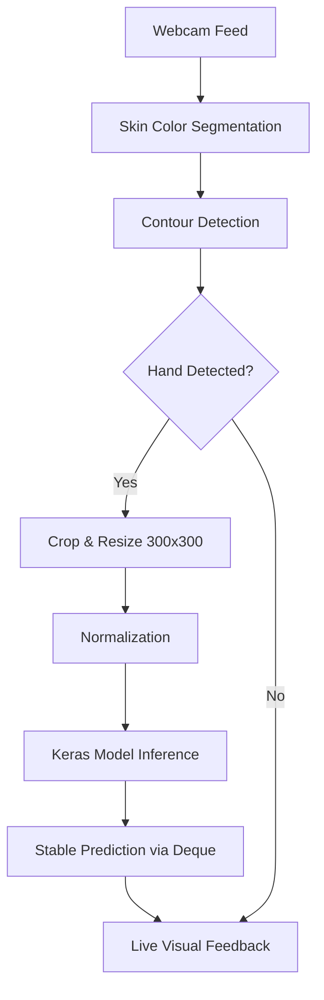

# 🖐️ Sign Language Recognition System

[](https://www.python.org/)
[](https://www.tensorflow.org/)
[](https://opencv.org/)
[](https://www.docker.com/)

An end-to-end, real-time sign language gesture recognition pipeline leveraging Computer Vision and Deep Learning. This project provides tools for both automated data collection and live inference.

---

## 📍 Table of Contents
- [✨ Features](#-features)
- [🏗️ Architecture](#️-architecture)
- [🚀 Quick Start](#-quick-start)
- [⚙️ Installation](#️-installation)
- [💻 Usage](#-usage)
- [📁 Project Structure](#-project-structure)
- [🔧 Configuration](#-configuration)
- [🌟 Examples](#-examples)
- [🤝 Contributing](#-contributing)
- [📜 License](#-license)

---

## ✨ Features

- **Real-time Recognition**: Low-latency gesture classification using optimized Keras models.
- **Automated Data Collection**: Streamlined script to capture and preprocess hand gestures for custom training sets.
- **Robust Preprocessing**: Integrated skin-color segmentation and contour detection for reliable hand isolation.
- **Standardized Input**: Automatic cropping and aspect-ratio-aware resizing (300x300) for model consistency.
- **Dockerized Environment**: Ready-to-use container setup for consistent deployment across different systems.

---

## 🏗️ Architecture

The system follows a modular pipeline from raw visual input to semantic label prediction:



### High-Level Pipeline
1.  **Capture**: Retrieves frames from the local camera.
2.  **Segmentation**: Converts BGR to HSV to isolate skin tones.
3.  **Processing**: Identifies the largest contour (the hand) and applies padding/resizing.
4.  **Inference**: Feeds the processed image into the `keras_model.h5`.
5.  **Smoothing**: Uses a `deque` and `Counter` to provide stable, flicker-free predictions.

---

## 🚀 Quick Start

Get the project running in under 2 minutes:

```bash
# 1. Clone the repository
git clone https://github.com/yourusername/sign-language-recognition.git
cd sign-language-recognition

# 2. Install dependencies
pip install -r requirements.txt

# 3. Run real-time inference
python test.py
```

---

## ⚙️ Installation

### Prerequisites
- **Python**: 3.8 or higher
- **Webcam**: Integrated or external USB camera
- **System Libs**: (Linux users) `libGL.so.1` is required for OpenCV.

### Step-by-Step Setup
1. **Create a Virtual Environment**:
   ```bash
   python -m venv venv
   source venv/bin/activate  # Windows: venv\Scripts\activate
   ```
2. **Install Packages**:
   ```bash
   pip install --upgrade pip
   pip install -r requirements.txt
   ```
3. **Docker Option**:
   ```bash
   docker build -t sign-lang-app .
   docker run --device /dev/video0:/dev/video0 sign-lang-app
   ```

---

## 💻 Usage

### 1. Data Collection
To train a custom model, you first need to collect data for specific gestures:
```bash
python data_collection.py
```
*   **Controls**: Show your hand to the camera. The script automatically saves 300x300 processed images to the `Sign_data/` directory when a hand is detected. Press `q` to move to the next label or quit.

### 2. Live Inference
Run the pre-trained model:
```bash
python test.py
```
*   **Feedback**: A window will show the live feed with a green bounding box around your hand and the predicted label displayed above it.

---

## 📁 Project Structure

```text
.
├── models/
│   ├── keras_model.h5      # Pre-trained Keras model
│   └── labels.txt           # Corresponding labels for model output
├── data_collection.py      # Utility for capturing training images
├── test.py                 # Main real-time inference script
├── Dockerfile              # Containerization instructions
├── requirements.txt        # Python dependencies
└── README.md               # Documentation
```

---

## 🔧 Configuration

Key parameters in `data_collection.py` and `test.py`:

| Parameter | Default | Description |
| :--- | :--- | :--- |
| `image_size` | 300 | Input dimensions for the neural network. |
| `offset` | 20 | Padding around the detected hand contour. |
| `prediction_interval`| 0.2s | Delay between model inferences to save CPU. |
| `deque(maxlen=7)` | 7 | Number of frames used for temporal smoothing. |

---

## 🌟 Examples

### Real-world Scenarios
1.  **Accessibility Tools**: Integrating this system into communication apps for the hearing impaired.
2.  **Touchless Interfaces**: Controlling smart home devices using specific hand gestures.
3.  **Educational Apps**: Teaching beginners basic Sign Language gestures with real-time feedback.

---

## 🤝 Contributing

Contributions are what make the open-source community such an amazing place to learn, inspire, and create.

1. Fork the Project
2. Create your Feature Branch (`git checkout -b feature/AmazingFeature`)
3. Commit your Changes (`git commit -m 'Add some AmazingFeature'`)
4. Push to the Branch (`git push origin feature/AmazingFeature`)
5. Open a Pull Request

---

## 📜 License

Distributed under the MIT License. See `LICENSE` for more information.

---

## 📧 Contact

**Project Lead** - [Your Name](mailto:your.email@example.com)

Project Link: [https://github.com/yourusername/sign-language-recognition](https://github.com/yourusername/sign-language-recognition)

---
*Developed with ❤️ for the Accessibility Community.*
